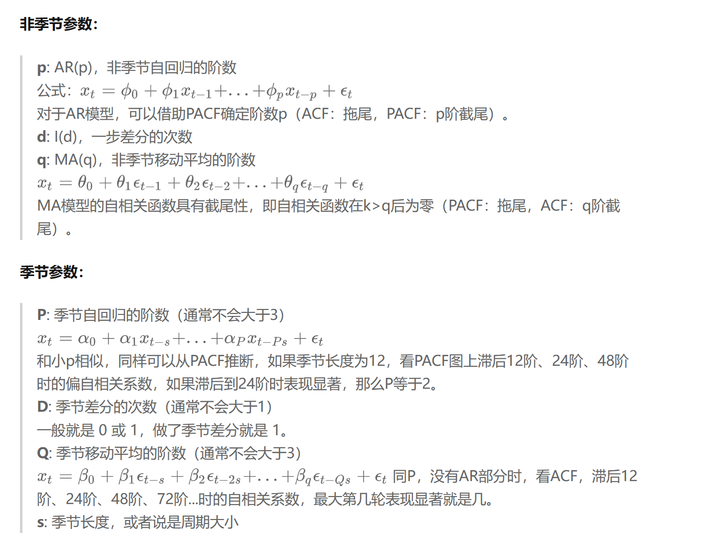
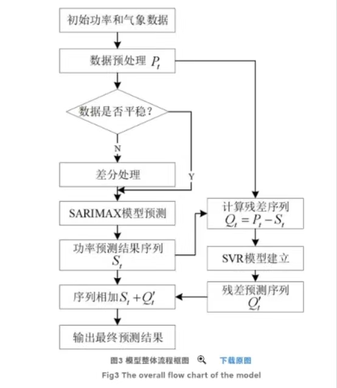

# 2023-CUMCM-C-BiNaXia

## 基于季节性ARIMAX与模拟退火的自动定价与补货策略

### 数据预处理

1. 缺失值异常值处理
2. 冗余值删除：没有被售卖的冗余数据删除

### 问题一

1. 检验数据正态性（绘图：直方图、QQ图）
2. 检验序列是否线性（绘图）

对单品和品类：使用==spearman相关系数==进行相关性分析（无正态性或非线性，若正态且线性，使用pearson）

对品类：（对单品的话太多了）

1. 检验各个品类之间是否为==同阶单整==数据（如果都不是，那就重新想想别的方法）
2. 对同阶单整的品类使用==协整检验==（是否有长期均衡关系）和==格兰杰因果检验==（检查两时序是否有因果关系）

对单品：

1. 统计各单品利润在其对应品类中的利润占比作为单品对品类的贡献（权重）。

### 问题二

1. 通过单品权重计算品类卖出的加权价格与加权损耗率；

假设时间为$t$，当天购入量为$x_t$，打折前卖出加权价格为$c_t$，打折后卖出加权价格为$c_t^‘$，损耗率为$p$，成本为$d_t$。

假设当天售出量为$n_t$，构造一个函数$g$，自变量为时间与加权定价，因变量为预计售出量；构造成本函数$h$，自变量为时间，因变量为对应成本。

2. 使用==季节性（若有）的时间序列模型==构建回归预测函数$g$；

规划目标：$argmax(\Sigma(P-C))$

对每个品类有如下对策：
$$
n_1 = g(t,c_t) \\
n_2 = g(t, c_t^‘) \\
c_t > c_t^‘ \\ 
d_t = h(t) \\
n_t = n_1(1 - p) + n_2p \\
x_t = n_t > 0 \\
P = \Sigma_{i=1}^7n_t((1 - p)c_t + pc_t^‘) \\
C = \Sigma_{i=1}^7x_td_t
$$

3. 使用模拟退火、牛顿法、梯度下降法、遗传算法等方法求解上述==规划==。

### 问题三

1. 找到6月24-30日可售单品；

2. 计算上述单品的==$g$函数==；

3. 规划：

假设时间为$t$，当天购入量为$x_t$，打折前卖出加权价格为$c_t$，打折后卖出加权价格为$c_t^‘$，损耗率为$p$。

假设最终选择的单品总数为$N$，最小陈列量$M$（$M = 2.5kg$），当天售出量为$n_t$

规划目标：$argmax(\Sigma_{i=1}^N(P_i-C_i))$
$$
27\le N\le 33
$$
对每个单品有如下对策：
$$
n_1 = g(t,c_t) \\
n_2 = g(t, c_t^‘) \\
c_t > c_t^‘ \\ 
d_t = h(t) \\
n_t = n_1(1 - p) + n_2p \\
x_t = n_t > M \\
P = n_t((1 - p)c_t + pc_t^‘) \\
C = x_td_t \\
$$

4. 使用模拟退火、牛顿法、梯度下降法、遗传算法等方法求解上述==规划==。

### 问题二与问题三中$g$函数与$h$函数的构造

输入：第$t$天的定价

输出：第$t$天的购买量

构建 ==SARIMAX-SVR 模型==（若无季节性，可以使用 VAR 或 ARIMAX 模型）

参数确定：[时间序列模型(四)：ARIMA模型 - 知乎 (zhihu.com)](https://zhuanlan.zhihu.com/p/634120397)

### 问题四

相关数据：

1. 2020年7月1日至2023年6月30日的天气数据以及预测时间的天气预报；
2. 每天运输不同单品的运输成本（单位：元/kg）；
3. 

假设第$t$天的天气情况为$w_t$，对应单品的运输成本为$q_t$。

利用上述算法，构造一个函数$\phi$，自变量为时间与加权定价与天气，因变量为预计售出量。

规划目标：$argmax(\Sigma_{i=1}^N(P_i-C_i))$
$$
27\le N\le 33
$$
对每个单品有如下对策：
$$
n_1 = \phi(t,c_t,w_t) \\
n_2 = \phi(t, c_t^‘,w_t) \\
c_t > c_t^‘ \\ 
d_t = h(t) \\
n_t = n_1(1 - p) + n_2p \\
x_t = n_t > M \\
P = n_t((1 - p)c_t + pc_t^‘) \\
C = x_t(d_t + q_t) \\
$$

计算出各单品的$P-C$后，按照排序，取出前$N$个单品即可。

### 模型假设

1. 在预测未来售出量时，我们假设不存在任何自然灾害、经济危机、系统风险等灾难；
2. 在使用==SARIMAX算法==进行回归预测时，我们假设其他的扰动项服从独立的正态分布；
2. 在规划中假设，所有单品在当日均售卖完毕，无法售卖的单品不在隔日重新售卖。

